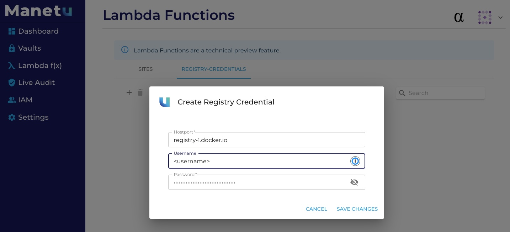
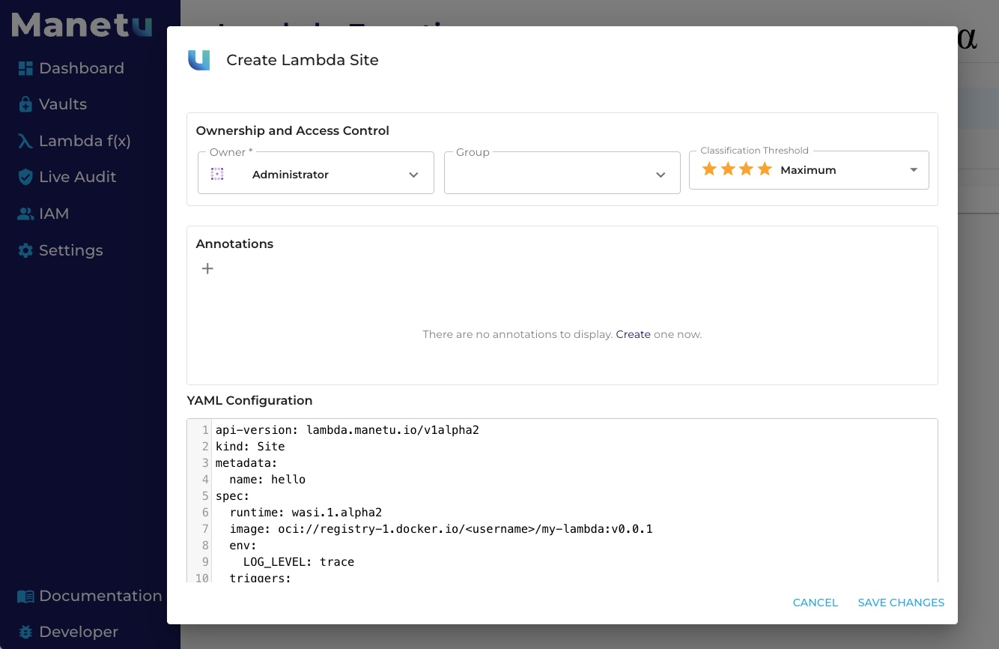

# lambda-sdk-go

This repository hosts an SDK for developing Lambda functions for the Manetu Platform in the [go](https://go.dev/) programming language.

## Prerequisites

- [tinygo](https://tinygo.org/)
- [wasm-to-oci](https://github.com/engineerd/wasm-to-oci)

## Project setup

### Create a directory for your project

``` shell
mkdir my-lambda
cd my-lambda
```

### Initialize a new go project in your working directory

``` shell
go mod init my-lambda
```

### Install dependencies

This SDK may be installed with

``` shell
go get -u github.com/manetu/lambda-sdk-go
```

We will also be using [zerolog](https://github.com/rs/zerolog) as part of our example

``` shell
go get -u github.com/rs/zerolog/log
```

### Create a main module and HTTP event handler

Create a file 'main.go' with the following contents:

``` golang
package main

import (
	"fmt"
	"github.com/rs/zerolog/log"
	"github.com/manetu/lambda-sdk-go"
	"os"
)

type context struct {
}

func (c context) Handler(request lambda.Request) lambda.Response {

	log.Printf("handling request %v", request.Params)

	greeting := fmt.Sprintf("Hello, %s", request.Params["name"])

	return lambda.Response{
		Status:  200,
		Headers: lambda.Headers{"Content-Type": "text/plain"},
		Body:    greeting}
}

func main() {
	lambda.Init(&context{})
	log.Print("Module initialized:", os.Environ())
}

```

### Compile the program

The Manetu platform serves Lambda functions within a [WebAssembly](https://webassembly.org/) environment.  We can leverage the [WASI support](https://tinygo.org/docs/guides/webassembly/wasi/) in tinygo to compile our program.

``` shell
tinygo build -o my-lambda.wasm --target=wasi main.go
```

### Publish the WASM code

We can leverage any [OCI](https://opencontainers.org/) registry to publish our Lambda function using the [wasm-to-oci](https://github.com/engineerd/wasm-to-oci) tool.
#### Example using dockerhub.com
Install the docker cli for your system, for example, on ubuntu

```shell
$ sudo apt-get install docker-ce-cli
```
Signup for a free account or login to https://hub.docker.com
Navigate to the https://hub.docker.com/settings/security and create a new Access Token with Read, Write and Delete scopes.

Log in to docker hub, providing the newly created access token when prompted for a password  (note: you many be prompted to configure a credential store)
```shell
$ docker login -u <username>
Login Succeeded
$
```
Push to the docker hub repository where <username> is replaced with your docker hub username. You may want to change the visibility of your docker hub registry. 
```shell
$ wasm-to-oci push my-lambda.wasm registry-1.docker.io/<username>/my-lambda:v0.0.1
INFO[0000] Pushed: registry-1.docker.io/<usename>/my-lambda:v0.0.1
INFO[0000] Size: 1280878
INFO[0000] Digest: sha256:19a6292e79635bb8e3d7125f16fd5745c5b45740497dde0fa996791edd2c1d9b
```

### Deploy your Lambda function

#### Define a specification for your Lambda function

Create a file 'site.yml' with the following contents (where `<username>` is your docker hub username):

``` yaml
api-version: lambda.manetu.io/v1alpha1
kind: Site
metadata:
  name: hello
spec:
  runtime: wasi.1.alpha2
  image: oci://registry-1.docker.io/<username>/my-lambda:v0.0.1
  env:
    LOG_LEVEL: trace
  triggers:
    http-queries:
      - route: /greet
        summary: "Returns a greeting to the user"
        description: "This request allows you to test the ability to deploy and invoke a simple lambda function."
        query-parameters:
          - name: "name"
            schema: { type: "string" }
            description: "The caller's name"
        responses:
          200:
            description: "computed greeting"
            content:
              text/plain:
                schema:
                  type: string
```

#### Add registry credentials to your manetu instance.

Add your docker token, username and registry url to the profile file in the root of this repo...
```shell
$ cat profile | grep DOCKER
export DOCKER_PAT=<replace-with-docker-token>
export DOCKER_USERNAME=<replace-with-docker-username>
export DOCKER_HOSTPORT=registry-1.docker.io
```

add your Manetu PAT and manetu instance dns names to the profile ...
````shell
cat profile | grep MANETU
export MANETU_PAT=<replace-with-manetu-pat
export MANETU_INSTANCE=<replace-with-manetu-dns-name>
export MANETU_URL=https://$MANETU_INSTANCE:443
export MANETU_GRAPHQL_URL=$MANETU_URL/graphql
````

Source the profile to set the environment variables needed by the bash scripts. Confirm that your Manetu environment is 
correctly setup by executing get_profile.sh.
````shell
$ source prodfile
$ sh ./get_profile.sh
{
  "data": {
    "get_profile": {
      "name": "Bertram Gilfoyle",
      "userid": "gilfoyle"
    }
  }
}
$
````
Add your docker registry credentials for your lambda container
````shell
$ sh ./create_regcred.sh $DOCKER_HOSTPORT $DOCKER_USERNAME
{
  "data": {
    "create_basicauth_regcred": {
      "hostport": "registry-1.docker.io",
      "last_updated": "2024-03-28T13:55:48.189Z",
      "mrn": "mrn:lambda:alpha:regcred:656fca51-c509-3c56-84ef-8aa1fc9ea22d",
      "version": "1711634148189"
    }
  }
}
````
Register your lambda function with your manetu instance
````shell
sh ./create_lambda.sh site.yaml
{
  "data": {
    "create_lambda": {
      "last_updated": "2024-03-28T13:59:08.049Z",
      "mrn": "mrn:lambda:alpha:site:hello",
      "paused": false,
      "version": "1711634348049"
    }
  }
}
````
Invoke your lambda function 
```shell
$ sh ./invoke-hello-lambda.sh Bertram Gilfoyle
Hello, Bertram Gilfoyle
$
```

#### Alternatively, register your lambda using the manetu ui.
Navigate to https://<manetu-instance>/realm/lambdas/registry-credentials and select the "+" to add credentials



#### Add the site to your lambda site
Navigate to https://<manetu-instance>/realm/lambdas/sites and select the "+" to add a site and upload they site.yaml defined above


#### Invoke your function
navigate to https://<manetu-instance>/lambda to exercise your function using the swagger ui. Note: your token will expire as the swagger interface does not refresh your access token
